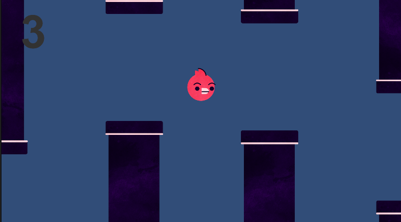
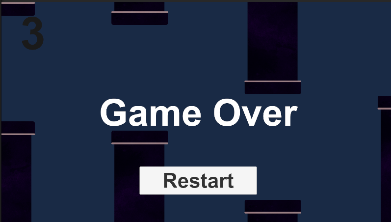

# Benyamin's Portfolio

## About Me
I’m passionate about game design and technology. Currently learning Unity and creating my first game projects.

## Projects
- Experimented with Unity tutorials.
- Created simple game prototypes.
- Working on an SDG-inspired game for CMGT intake.

## Skills
- Unity basics
- C# (beginner)
- Game design ideas
  
# My Flappy Bird Inspired Game Project

This is a simple Flappy Bird style game I made using Unity for my CMGT intake.  
I coded the bird's movement, collision detection, and game over logic using C#.  
The game challenges players to navigate through pipes without hitting obstacles.

You can find the BirdScript.cs file in the Assets folder of this repo. It controls the bird's movement and handles collisions.

## Screenshots

