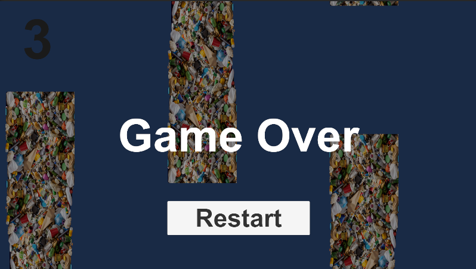

# Benyamin's Portfolio

## About Me
I’m passionate about game design and technology. Currently learning Unity and creating my first game projects. I’m excited about combining fun gameplay with meaningful messages that can inspire positive change.

## ProjectsProjects
-Experimented with Unity tutorials.
-Currently developing an SDG-inspired game focused on environmental awareness for my CMGT intake.

## Skills
- Unity basics

- C# (beginner)

- Game design ideas
  
# My Flappy Bird Inspired Game Project

This project started as a simple Flappy Bird-style game made using Unity for my CMGT intake.
Recently, I reimagined it with an environmental theme by replacing the traditional pipes with stacks of trash to raise awareness about pollution and waste management. For the SDG, especially SDG 12 (Responsible Consumption and Production) and SDG 13 (Climate Action).

Players navigate the bird through obstacles symbolizing pollution, encouraging reflection on the importance of reducing waste and protecting the environment.

I coded the bird's movement, collision detection, and game over logic using C#. The BirdScript.cs and more can be found in the scripts folder.

## Screenshots

